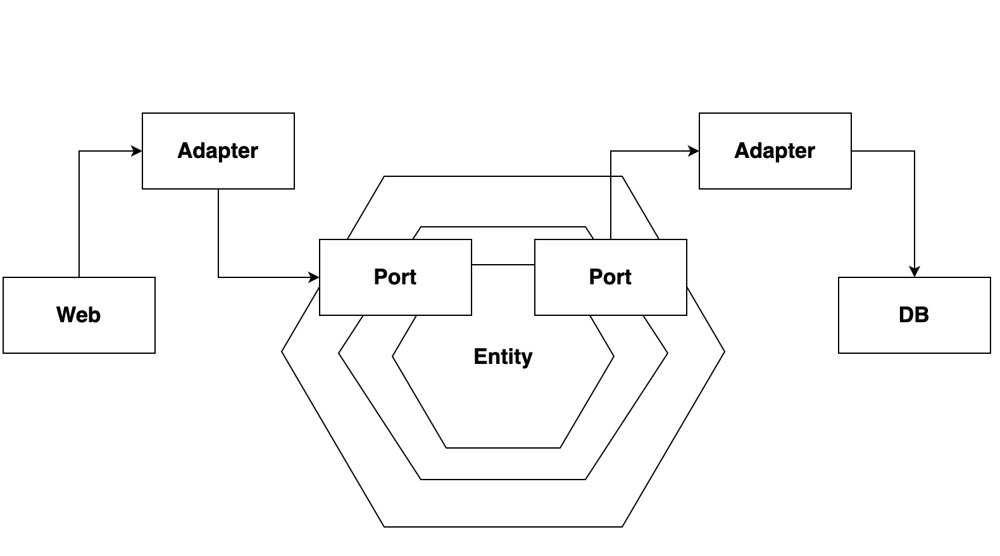
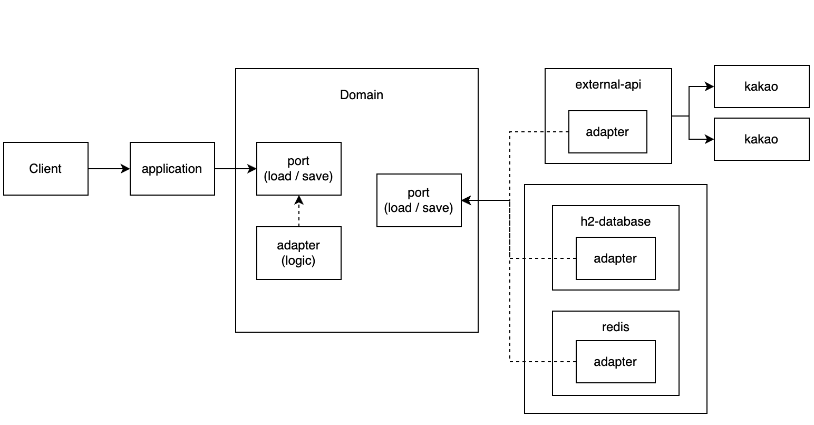

# 블로그 검색 서비스 구현 #

## 프로젝트 정보
- Java 11
- Spring Boot 2.7.9
- H2 Database
- Spring Data JPA
- Embedded redis
- Gradle
- 
<br>

## 실행 방법
1. 프로젝트의 [application-1.0.-SNAPSHOT.jar](https://github.com/ldonghee/BlogSearch/blob/master/application-1.0-SNAPSHOT.jar) 다운로드
2. 터미널에서 파일 경로로 이동 후 `java -jar blog-search-bokeunjeong-0.0.1-SNAPSHOT.jar` 명령어 입력


## 설계
- 멀티 모듈과 hexagonal 아키텍처 도입
- 서로 다른 Bounded Context 기준으로 나누어 상호 관계가 명확해지도록 하였음
- 단방향 흐름을 통해 모듈관 의존성 최소화
- 보유한 성격과 특성(역할과 책임)에 따라 모듈 분리 
- 모듈 설명
  - application : 애플리케이션 모듈
  - domain : 도메인 모듈(핵심 비지니스)
  - infrastructure 
    - datastore-h2 : h2 데이터베이스 모듈
    - datastore-redis : 레디스 케시 모듈
  - external-api : 외부 연동 모듈 (카카오/네이버 연동)
- 의존성을 단방향으로 흐르게 하여 독립적인





<br>

## 추가 구현 내용
- 트래픽이 많은 상황을 대비해 블로그 검색 API는 Embedded Redis를 활용하여 로컬 캐시 적용하여 요청을 최소화
- 동시성 이슈관련해 aop와 redis 서버와 Redisson 을 사용하여 분산락 적용 
- 카카오 API 정상 응답 못받을 경우, 네이버 API 호출하여 결과 제공


<br>

## API 명세
### 1. 블로그 검색
#### Request
```bash
curl -X GET http://localhost:8080/blog/search?keyword=acd&page=1&size=2&sort=accuracy
```
| Name  | Type      | Description                                                  | Required |
|:------| :-------- | :----------------------------------------------------------- | :------- |
| query | `String`  | 검색 키워드                                                  | O        |
| sort  | `String`  | 정렬 방식, accuracy(정확도순) 또는 recency(최신순), 기본 값 accuracy | X        |
| page  | `Integer` | 결과 페이지 번호, 1~50 사이의 값, 기본 값 1                  | X        |
| size  | `Integer` | 한 페이지에 보여질 문서 수, 1~50 사이의 값, 기본 값 10       | X        |

<br />

#### Response
```json
{
  "blogs": [
    {
      "title": "아남 <b>ACD</b>-77 (CD 플레이어)",
      "url": "https://blog.naver.com/gh1audio_/223187357060",
      "contents": "아남 <b>ACD</b>-77 CD 플레이어. 특별한 고장이 있는 건 아니고, 20여년전 새제품을 구입했는데, 많이 사용하지 않고 대부분의 시간을 방치상태로 둬서 제대로 작동이 될지 모르겠다고 한다. 아남이 만든 미니컴포넌트 77시리즈의 구성품으로, 중고시장에서 지금도 여전히 인기가 많은 베스트셀러중 하나이다. 예방정비 특별한...",
      "blogName": "GH1Audio",
      "datetime": "2023-08-18T21:26:00.000+09:00"
    },
    {
      "title": "헌터 가방 백팩 UBB6017<b>ACD</b> 사이드 패스너 포켓 배낭 ag-1226",
      "url": "https://blog.naver.com/50commons/223256724070",
      "contents": "헌터 가방 백팩 UBB6017<b>ACD</b> 사이드 패스너 포켓 배낭 ag-1226 : 피프티커먼즈 클릭하시면 구입하실 수 있는 쇼핑몰로 이동합니다. smartstore.naver.com 일본에서 직배송하는 100% 정품 제품 입니다 ​ ​ 헌터 가방 백팩 UBB6017<b>ACD</b> 사이드 패스너 포켓 배낭 ag-1226 ​ HUNTER HanaHana 전자기 ManaHana 자기 1 : UBB6017<b>ACD</b>...",
      "blogName": "100% 정품 일본 구매대행, 피프티커먼즈",
      "datetime": "2023-11-06T07:07:00.000+09:00"
    }
  ]
}
```

<br/>

### 2. 인기 검색어 목록 조회

#### Request
```bash
curl -X GET http://localhost:8080/keyword/popular
```

<br/>

#### Response
```json
{
  "keywords": [
    {
      "query": "test4",
      "count": 103
    },
    {
      "query": "test3",
      "count": 101
    },
    {
      "query": "test10",
      "count": 99
    },
    {
      "query": "test9",
      "count": 88
    },
    {
      "query": "test2",
      "count": 20
    },
    {
      "query": "test11",
      "count": 19
    },
    {
      "query": "test6",
      "count": 15
    },
    {
      "query": "test12",
      "count": 13
    },
    {
      "query": "test7",
      "count": 12
    },
    {
      "query": "test5",
      "count": 12
    }
  ]
}
```

<br/>